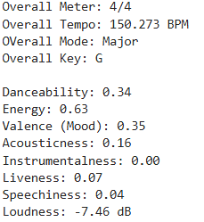
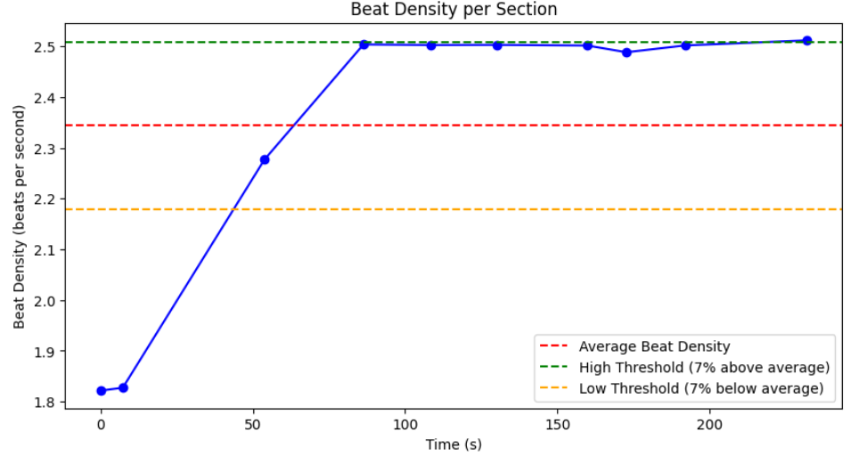
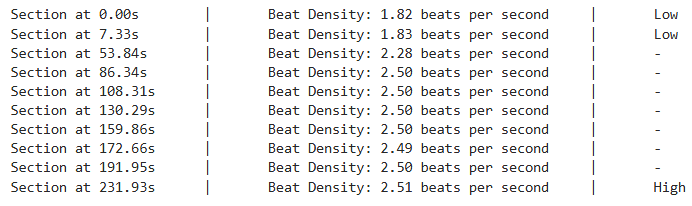
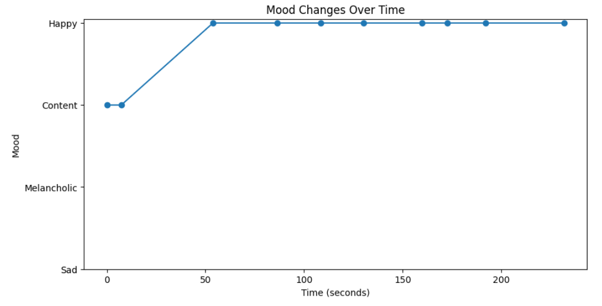
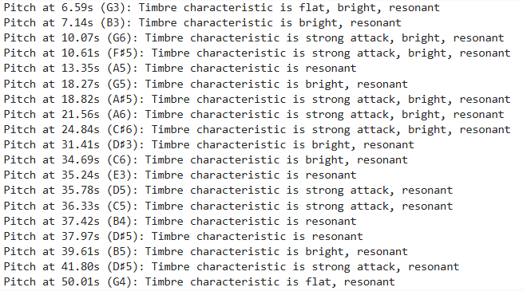
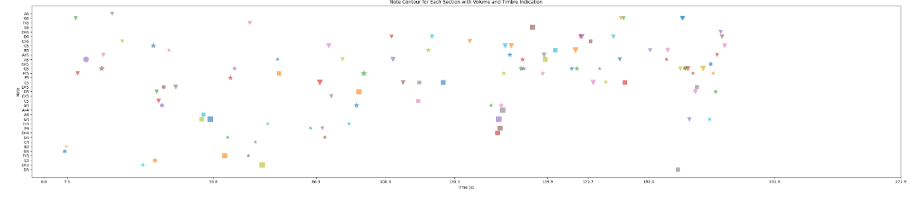
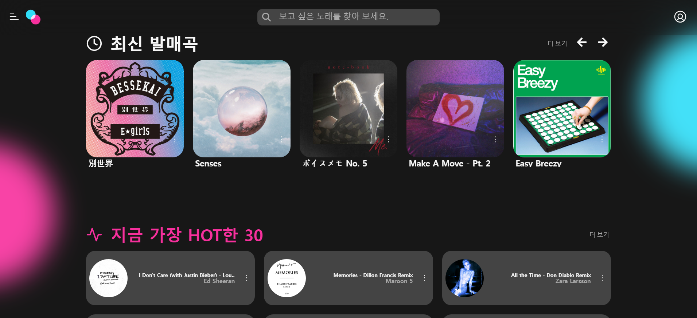
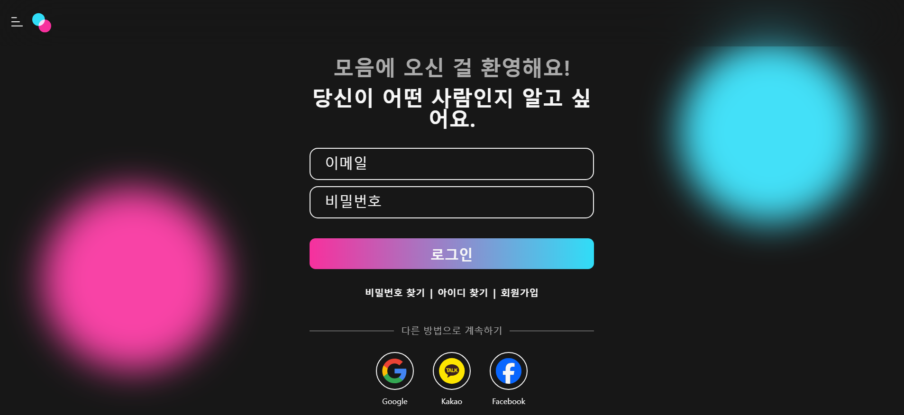
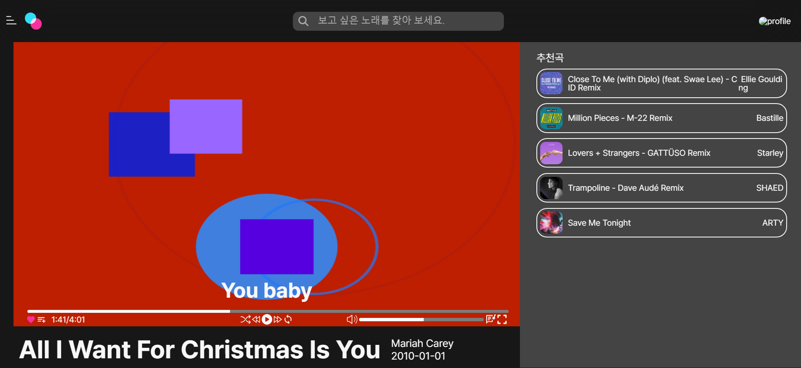
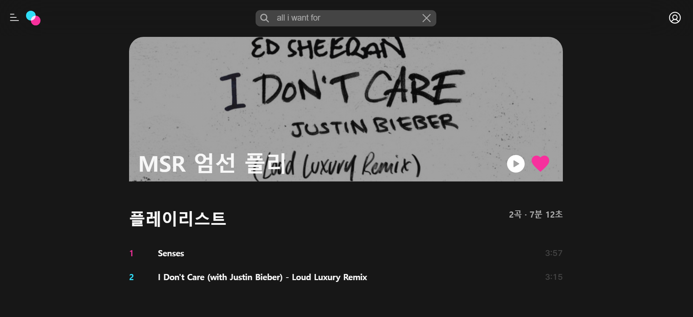

# 📜 목차

1. [프로젝트 소개 및 핵심 기능](#1-프로젝트-소개-및-핵심-기능-)
2. [팀원 구성](#2-팀원-구성-)
3. [아이디어 기획](#3-아이디어-기획)
4. [시각화 시 고려 사항](#4-시각화-시-고려-사항)
5. [관련 논문 정리](#5-관련-논문-정리)
6. [요구사항 명세서](#6-요구사항-명세서)
7. [API 명세서](#7-API-명세서)
8. [데이터 분석](#8-데이터-분석)
9. [실행 화면](#9-실행-화면)

# 1. 프로젝트 소개 및 핵심 기능 🔍

- 프로젝트명: 모두의 음악

- 서비스 특징: 청각 장애인을 위한 음악 시각화 서비스

- 주요 기능
  
  - 데이터 분석 및 AI 모델을 활용한 음악 시각화
  
  - AI 모델을 활용한 가사 시각화
  
  - 음악 추천 알고리즘
  
  - 카테고리별 음악 분류 기능
  
  - 마이 플레이리스트 생성 기능
  
  - 노래, 앨범, 아티스트 좋아요 기능

- 프로젝트의 특장점(기능 관점)
  
  - 소리를 완전히 또는 부분적으로 듣지 못하는 청각 장애인을 위해
    
    - 음악의 박자, 분위기, 음, 재상 시간 등 시각화
    
    - 생성형 AI를 통해 가사 시각화
    
    - 내 취향에 맞는 음악 맞춤 추천
  
  을 사용자 편의성을 고려한 UI, UX화 함께 지원

- 프로젝트의 차별점/독창성(기술 관점)
  
  - matter.js를 활용해 프론트엔드 상에서 Unity와 같은 물리엔진(예: RigidBody, Conllider 등) 구현
  
  - Librosa + FastAPI를 활용해 음악 분석
  
  - MSA 도입

- 기술 스택
  
  - 백엔드
  - Java 17, Spring Boot 3. 3. 5, Python 3.10, FastAPI 0.11.0, ElasticSearch, RabbitMQ
  - 프론트엔드
    - React 18.3.1, TypeScript, Zustand, Emotion, Matter.js
  - DB
    - MariaDB, Redis, MongoDB
  - Infra
    - Ubuntu 24.04, Docker, Jenkins

# 2. 팀원 구성 👥

| **민서령**                              | **박병우**                                 | **서장원**                                  | **김재혁**                              | **김시현**                              | **최진오**                                 |
| ------------------------------------ | --------------------------------------- | ---------------------------------------- | ------------------------------------ | ------------------------------------ | --------------------------------------- |
| 팀장, 백엔드                                  | 백엔드                                     | 백엔드 팀장                                      | 프론트엔드 팀장                                | 프론트엔드                                | 프론트엔드, DevOps                                   |
| [GitHub](https://github.com/mremule) | [Github](https://github.com/byeongwooPark) | [Github](https://github.com/Seo-Jangwon) | [Github](https://github.com/kayas1) | [Github](https://github.com/kimsihyeon24) | [Github](https://github.com/sidamodev) |

# 3. 아이디어 기획

- 주제: 청각 장애인을 위한 음악 시각화 서비스

- 대상
  
  - 청각 장애인
  
  - 10~20대 트렌디한 경험을 추구하는 비장애인
  
  ## MVP
  
  ### ✅ 음악 시각화
  
  1. 음파 분석
  
  2. 1의 결과물을 바탕으로 음악의 악기, 볼륨, 강세, 박자 등 음악 구성 요소 수치화
  
  3. 2의 결과물을 단색, 그라데이션, 색상이 특정 방향으로 번지는 속도, 도형 등으로 시각화
  
  **시각화 디자인**
  
  1. 분위기 : color (gradient)
  
  2. mode : 장/단조
  
  3. liveliness → 세 개의 property를 수치로 환산해서 표현
     
     1. danceability
     2. energy
     3. valence
  
  4. 박자 : line
  
  5. 음 : shape, 간단한 기초 도형들의 조합으로 표현 (시스템)
     
     1. key(C~B)
     2. volume
     3. *Timbre*
  - 시각화 참고자료
    
    - [Taste Visualization for Pixar's Ratatouille (Synesthesia) - Michel Gagné - 1080P - YouTube](https://www.youtube.com/watch?v=xizttM_Cbuc)
    
    - https://www.fastcompany.com/90822202/what-sound-looks-like-according-to-ai
  
  ### ✅ 가사 시각화 (On/Off 가능)
  
  1. 음악 정보 사이트에서 재생 시간에 싱크된 가사 정보 크롤링
  2. 1의 결과물을 DB에 저장
  3. 음악을 시각화한 결과물에 맞춰 비슷한 분위기로 가사를 시각화한 결과물을 합성
  
  ### 음악 추천
  
  1. 좋아요, 1분 이상 들은 음악 기록을 바탕으로 비슷한 음파 형태의 음악 추천
  2. 비슷한 기록을 가진 사람들의 플레이리스트를 바탕으로 음악 추천
  
  ### 나만의 플레이리스트
  
  - 음악 좋아요
  - 나만의 플레이리스트 제작 및 공유
    - 공유시 시각화 결과물 스크린샷 → 대표 이미지 설정 (png로 다운로드 가능)
  
  

# 4. 시각화 시 고려 사항

- 색채 심리학 기반의 개인화 색상 질문 리스트
  
  **1. 즐거움**
  
  **2. 슬픔**
  
  **3. 고요함**
  
  **4. 요란함**
  
  **5. 놀람**
  
  **6. 차분함**
  
  **7. 분노**
  
  **8. 사랑**
  
  이 8가지 질문들은 사용자가 색상과 감정의 관계를 심리학적으로 탐구할 수 있도록 유도하며, 색상 팔레트 설정 과정을 더욱 의미 있고 개인화된 경험으로 만듭니다.

- 시각적 디스플레이를 만들 때 고려 요소들
  
  1. 음표의 시작 (Note onset):
     - Librosa (Python): librosa.onset.onset_detect()
     - Essentia (C++/Python): OnsetDetection 알고리즘
  2. 음의 길이 (Note duration):
     - Pretty_midi (Python): note.end - note.start
     - JFugue (Java): Note 객체의 getDuration() 메소드
  3. 음높이 (Pitch):
     - Librosa (Python): librosa.yin() 또는 librosa.pyin()
     - TarsosDSP (Java): PitchDetector 인터페이스
  4. 음량 (Loudness):
     - Librosa (Python): librosa.feature.rms()
     - TarsosDSP (Java): AmplitudeFollower 클래스
  5. 악기 종류 (Instrument type):
     - TensorFlow (Python): 사용자 정의 CNN 모델
     - OpenL3 (Python): 오디오 임베딩 추출 후 분류
  6. 조성 변화 (Key changes):
     - Librosa (Python): librosa.feature.tonnetz()
     - Essentia (C++/Python): KeyExtractor 알고리즘
  7. 리듬 (Rhythm):
     - Librosa (Python): librosa.feature.tempogram()
     - jAudio (Java): BeatHistogramFeature 클래스
  8. 화성 (Harmony):
     - Librosa (Python): librosa.feature.chroma_stft()
     - TarsosDSP (Java): ConstantQ 변환 후 처리
  9. 음색 (Timbre):
     - Librosa (Python): librosa.feature.mfcc()
     - Essentia (C++/Python): MFCC 알고리즘
  10. 템포 (Tempo):
      - Librosa (Python): librosa.beat.tempo()
      - BeatRoot (Java): Agent 클래스
  11. 음악의 구조 (Musical structure):
      - MSAF (Python): 다양한 세그멘테이션 알고리즘 제공
      - Essentia (C++/Python): MusicExtractor 클래스
  12. 감정 (Emotion):
      - Keras/TensorFlow (Python): 사용자 정의 LSTM 모델
      - OpenSmile (C++/Python): 감정 관련 특성 추출

# 5. 관련 논문 정리

[Notion – 논문1](https://www.notion.so/1-Enhancing-Musical-Experience-for-the-Hearing-Impaired-Using-Visual-and-Haptic-Displays-120d3d8d97a08034932eef10f368b55d)

[Notion – 논문2](https://www.notion.so/2-Music-to-Facial-Expressions-Emotion-Based-Music-Visualization-for-the-Hearing-Impaired-7bd46412b07c4d20946748c9f32a4a65)

[Notion – 논문3](https://www.notion.so/3-An-Enhanced-Musical-Experience-for-the-Deaf-Design-and-Evaluation-of-a-Music-Display-and-a-Hapti-f0f4c35447f74278afdbcd8ee8fe706a)

# 6. 요구사항 명세서

[Notion – Use Case](https://www.notion.so/341064e1d74c4d9cbd39d698f37916ef)

# 7. API 명세서

[Notion – API 명세서](https://www.notion.so/API-abe308c4ddd042d5925242acf4daae0d)

# 8. 데이터 분석

# 9. 실행 화면

### 메인 페이지

### Login 페이지

### Calibration 페이지

### Visualization

### Playlist 페이지

